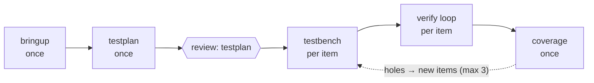

# plan.md Format

`plan.md` is the approved contract for a run. The orchestrator dispatches only what it describes; any change after approval goes back through `reviews/plan.md`.

## Template

````md
# Plan: <goal>

**Run**: <run-id>   **Objective**: <e.g. wall-clock time>   **Base branch**: <branch>
**Concurrency**: global <n>; <tool>: <n>, ...   **Tool mode**: gui | batch

## Graph



## Stages

### <stage-id>
- **Skills**: <skill names + paths>
- **Runs**: once | per item
- **Inputs**: <files or upstream stage outputs>
- **Outputs**: <files>
- **Edit scope**: <paths it may change>
- **Tool**: <tool, or none>   **Finish marker**: <log line / file>
- **Loop**: <none> | exit check `<command or log condition>`; progress `<measure>` (higher|lower is better); hard cap <n>
- **Gate**: none | check `<command>` | review
- **Hooks**: <hook names from HOOKS.md patterns, or none>

## Items
<what an item is; which stage produces the list; initial list if known>

## Feedback edges
- <from> → <to>: <trigger>; max <n> round trips

## Expected critical path
<the chain of stages expected to dominate wall-clock, and why>

## Assumptions
<anything not confirmed by the user or the environment>
````

## Diagram rules

- Stages are rectangles, labelled with `once` or `per item`. Human review gates are hexagons `{{review: ...}}`. Feedback edges are dotted, labelled with trigger and cap.
- Keep the plan diagram at stage level; never draw one node per item.
- `STATUS.md` reuses the same diagram with a status class on each stage (see [RUN-STATE.md](RUN-STATE.md)).

## Rules

- **Every loop has a machine-checkable exit.** "Debugged" is not an exit check; "`lint.log` has 0 errors" is. A root cause identified and logged is a valid exit for a debug loop when the plan says so.
- **Every stage has an edit scope.** A verification stage may edit the testbench, never the RTL or spec.
- **Once approved, the plan is frozen.** Mid-run learning goes into briefs and stage-scoped hooks, logged; structural changes need re-approval.
